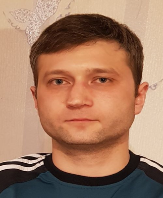

Артём Цмыг
Телефон: +7(981)919 82-65
Email: artemtsmyg@yandex.ru
Telegram: @ArtemTsmyg
Город проживания: Санкт-Петербург
Дата Рождения: 22.09.1989 
GitHub: https://github.com/artemtsmyg/DZ.Spring.sem4.git

java-разработчик

Навыки

●	Java, java-core, jdk
●	Spring
●	ООП
●	Работа со сторонними API
●	Базовые знания языка Python 
●	Базовые знания языка C#	
●	Работа с системами контроля версий (Git)
●	HTML, CSS3 
●	MySql, js
●	Знания excel, Figma.

Опыт работы

Есть учебный опыт, писал программы на языке java а так-же знаю ООП и Spring и многое другое.

Образование

Проффесиональный торгово-экономический лицей №148

Курсы и тренинги

GEEKBRAINS
Веб-разработка на JAVA, C-14.03.2023 ПО-01.06.2024.

Английский язык, Уровень A2

Обо мне 

Всегда интересовался сферой IT (программировал на java), планирую дальше развиваться в сторону веб-разработки. Уже хорошо освоил вёрстку и JavaScript, на данный момент изучаю python, html и MySQL.
К своим сильным сторонам могу отнести навыки работы в команде, желание найти максимально результативное и красивое решение, способность самостоятельно искать ресурсы, помогающие решить проблему или повысить мой профессиональный уровень, сильный интерес к разработке.

Рассматриваю стажировку или вакансию junior java-разработчика, проектную деятельность, работу в офисе.